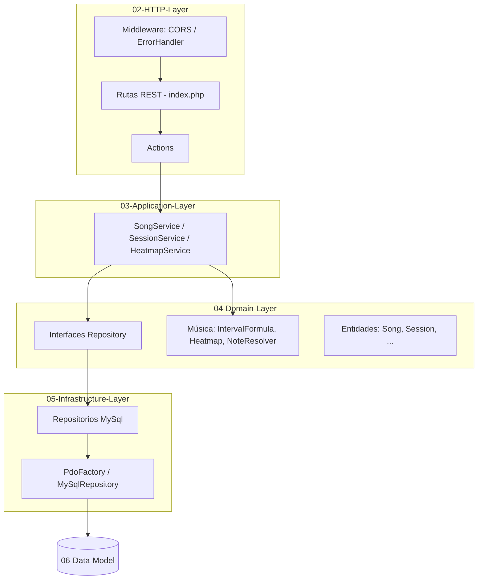
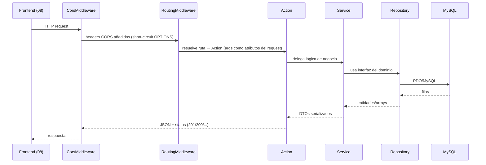

# 01 — Arquitectura

## Resumen

API **monolítico en capas** con dependencia invertida (DIP): el dominio define interfaces y la infraestructura las implementa. El contenedor **PHP-DI** (vía `php-di/slim-bridge`) ensambla todo por autowiring + bindings explícitos en `config/settings.php`.

## Capas

## Flujo de una petición

## Decisiones clave

- **slim-bridge**: las Actions reciben `request`/`response` por nombre y los placeholders de ruta (`{id}`) se inyectan como **atributos** del request (`$request->getAttribute('id')`).
- **Errores**: `JsonErrorHandler` convierte excepciones del dominio y de Slim (`HttpException`) a JSON con códigos correctos (404/405/400/500) y maneja preflight OPTIONS (200 + `Allow`).
- **CORS**: `CorsMiddleware` es el middleware más externo; responde preflight y añade headers a toda respuesta.
- **Sin framework frontend**: JS vanilla; el estado vive en `app.js` y el audio usa Web Audio API.
