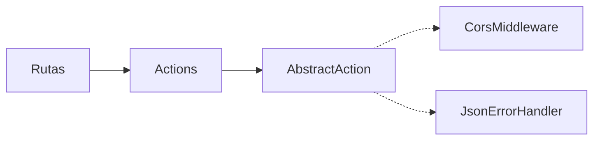

# 02 — HTTP Layer

Punto de entrada `api/index.php`: crea el contenedor, registra middleware y define las rutas. Sin framework adicional: las rutas apuntan a clases `Action` (resolvidas por DI).

## Middleware (orden de ejecución)

Se añaden en orden inverso: **Cors** (externo) → **Routing** → **BodyParsing** (interno).

- `App\Http\Middleware\CorsMiddleware` — añade headers CORS a toda respuesta; responde preflight `OPTIONS` con 200 sin llegar al router.
- `App\Http\Middleware\JsonErrorHandler` — handler por defecto del error middleware; mapea excepciones a JSON.

## Base de las Actions

`AbstractAction` provee helpers:

- `json()` — escribe body JSON + status + Content-Type.
- `id()` — resuelve el id desde args de ruta, atributos del request (`getAttribute('id')`) o query params.
- `parsedBody()` / `methodNotAllowed()`.

## Actions y rutas

| Ruta | Métodos | Action |
|---|---|---|
| `/api/notes` `/api/chords` `/api/scales` `/api/tunings` | GET | Notes / Chords / Scales / TuningsAction |
| `/api/sessions` | GET, POST | SessionsAction |
| `/api/sessions/{id}` | GET, DELETE | SessionsAction |
| `/api/sessions/{id}/items` | POST | SessionItemsAction |
| `/api/session-items/{id}` | DELETE | SessionItemsAction |
| `/api/harmony` | POST | HarmonyAction |
| `/api/songs` | GET, POST | SongsAction |
| `/api/songs/{id}` | GET, DELETE | SongsAction |
| `/api/songs/{id}/sections` | POST | SongSectionsAction |
| `/api/song-sections` / `/api/song-sections/{id}` | POST / PUT, DELETE | SongSectionsAction |
| `/api/song-measures` / `/api/sections/{id}/measures` / `/api/song-measures/{id}` | POST / POST / DELETE | SongMeasuresAction |
| `/api/song-events` / `/api/measures/{id}/events` / `/api/song-events/{id}` | POST / POST / PUT, DELETE | SongEventsAction |

> Detalle completo en [[07-API]].

## Convención de IDs

- **Rutas anidadas**: el id del padre viene del placeholder de ruta (ej. `measure_id` en `/api/measures/{id}/events`).
- **Rutas planas**: el id viene del body (legacy) o del placeholder `{id}` según el método.

## Errores

`JsonErrorHandler` (extiende `Slim\Handlers\ErrorHandler`) en [[05-Infrastructure-Layer]]; mapeo:
`HttpException` (404/405) · `NotFoundException` (404) · `ValidationException` (400) · resto → 500.
