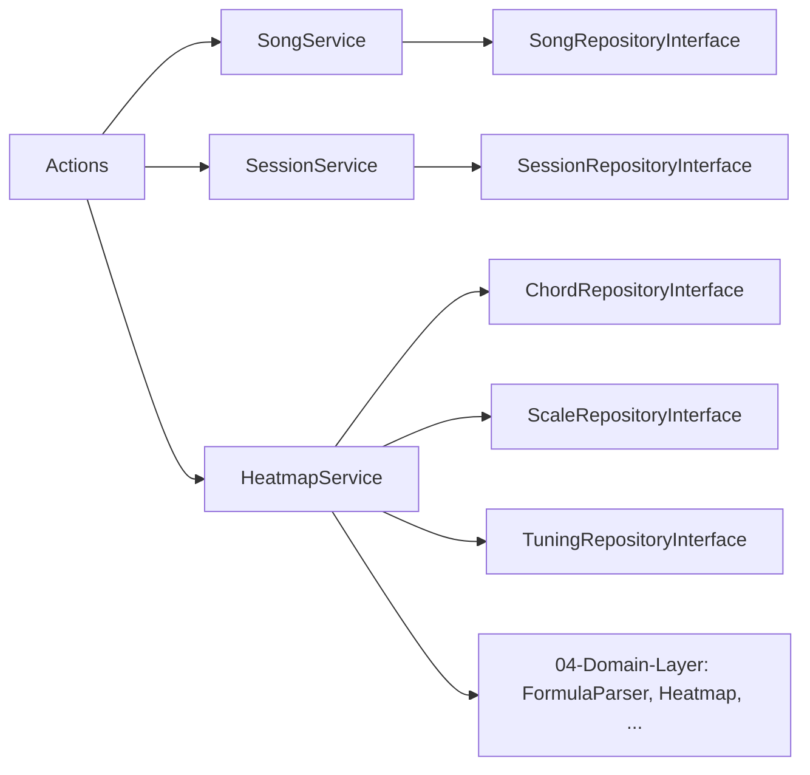

# 03 — Application Layer

Servicios de aplicación (capa `App\Application`): contienen la lógica de negocio orquestada, dependen de **interfaces** del dominio y devuelven arrays serializables (DTOs JSON).

## SongService

Orquesta el **Song Builder**: canciones, secciones, compases y eventos.

| Método | Responsabilidad |
|---|---|
| `list()` / `get($id, $withPlayerData)` | listado / detalle; opcional `player_data` |
| `create()` / `delete()` | alta / baja de canción (cascade) |
| `addSection()` / `updateSection()` / `deleteSection()` | secciones |
| `addMeasure()` / `deleteMeasure()` | compases |
| `upsertEvent()` / `updateEvent()` / `deleteEvent()` | eventos (acorde/escala por compás) |
| `serialize()` / `buildPlayerData()` | DTO JSON + datos del player (heatmap por compás) |

## SessionService

Sesiones de práctica en el fretboard.

| Método | Responsabilidad |
|---|---|
| `list()` / `get()` | listado / detalle con items |
| `create()` / `delete()` | alta / baja |
| `addItem()` / `deleteItem()` | añade/elimina CHORD/SCALE a una sesión |

## HeatmapService

Calcula el **heatmap** del fretboard para un set de elementos (acordes/escalas sobre una afinación).

| Método | Responsabilidad |
|---|---|
| `calculate($tuningId, $items)` | agrega influencias → `heatmap` + `influence` |
| `resolveFormula()` | traduce un item a `IntervalFormula` vía repositorio |
| `requireRootNote()` | valida `root_note` y lanza `ValidationException` |

> La lógica musical pura está en [[04-Domain-Layer]]; estos servicios solo la orquestan y validan.
