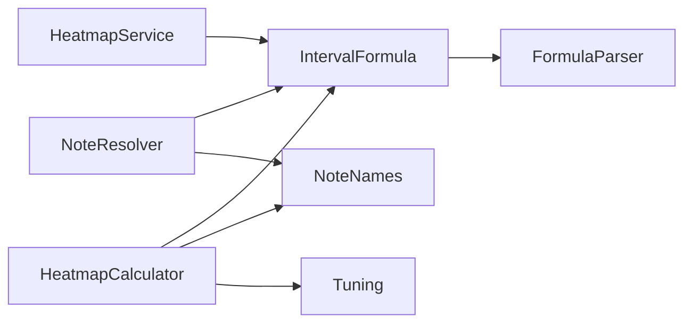
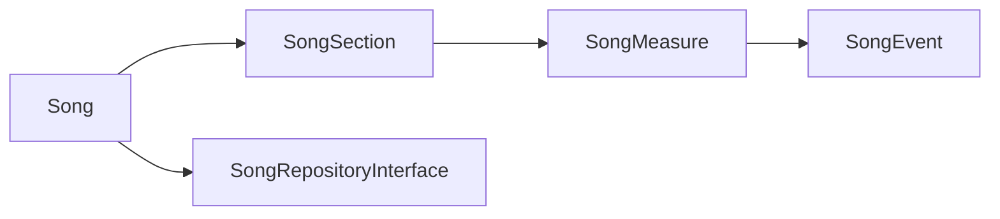

# 04 — Domain Layer

Capa `App\Domain`: entidades, lógica de música pura, interfaces de repositorio (DIP) y excepciones. **No depende** de nada externo (sin Slim, sin PDO).

## Música (`Domain\Music`)

| Clase | Rol |
|---|---|
| `IntervalFormula` | fórmula (ej. `0,4,7`) con valores absolutos por octava |
| `FormulaParser` | parsea fórmulas CSV (de BD) a intervalos |
| `NoteNames` | nombre de nota por posición cromática + por afinación |
| `NoteResolver` | resuelve nota real a partir de raíz + intervalo |
| `Heatmap` | estructura de datos de influencia por cuerda/traste |
| `HeatmapCalculator` | pinta influencia de intervalos sobre las cuerdas |
| `Tuning` | afinación (cuerdas → posiciones cromáticas) |

### Interfaces (contratos de datos)
`NoteRepositoryInterface` · `ChordRepositoryInterface` · `ScaleRepositoryInterface` · `TuningRepositoryInterface` — implementadas en [[05-Infrastructure-Layer]].

## Sesiones (`Domain\Session`)

- `Session` — entidad (id, nombre, tuning).
- `SessionItem` — ítem (type CHORD/SCALE, reference_id, root_note, position).
- `SessionRepositoryInterface` — contrato de persistencia.

## Canciones (`Domain\Song`)

Jerarquía **Song → Section → Measure → Event** (en cascada, ver [[06-Data-Model]]):

- `Song` — metadatos (bpm, tuning, métrica).
- `SongSection` — sección con color y posición.
- `SongMeasure` — compás con posición.
- `SongEvent` — cambio en un compás (beat, elemento, raíz, notas).
- `SongRepositoryInterface` — contrato CRUD de todo el árbol.

## Excepciones

- `NotFoundException` → **404**
- `ValidationException` → **400** (mensajes agregados de validación)

> Mapeadas a HTTP por `JsonErrorHandler` en [[02-HTTP-Layer]].
