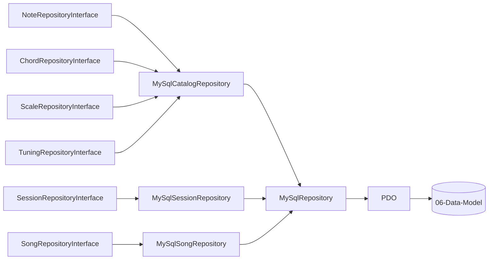

# 05 — Infrastructure Layer

Capa `App\Infrastructure`: implementaciones concretas (MySQL/PDO) de las interfaces del dominio, más el wiring de DI.

## Componentes

| Clase | Rol |
|---|---|
| `Database\PdoFactory` | crea la conexión PDO (params desde env) |
| `Database\MySqlRepository` | base con helpers comunes (fetch, insert, etc.) |
| `Repositories\MySqlCatalogRepository` | implementa las 4 interfaces de catálogo (notes/chords/scales/tunings) |
| `Repositories\MySqlSessionRepository` | implementa `SessionRepositoryInterface` |
| `Repositories\MySqlSongRepository` | implementa `SongRepositoryInterface` (árbol completo con cascade) |

## Wiring (config/settings.php)

Bindings **interfaz → implementación** (una sola implementación por contrato):

| Interfaz | Implementación |
|---|---|
| Note/Chord/Scale/TuningRepositoryInterface | `MySqlCatalogRepository` |
| SessionRepositoryInterface | `MySqlSessionRepository` |
| SongRepositoryInterface | `MySqlSongRepository` |
| `PDO` | factory desde `PdoFactory` |
| `ResponseFactoryInterface` | `Slim\Psr7\ResponseFactory` |

Parámetros vía `env()`: `DB_HOST`, `DB_NAME`, `DB_USER`, `DB_PASS`, `APP_DEBUG`.

## Mapeo de errores

`JsonErrorHandler` (usado aquí como middleware global, [[02-HTTP-Layer]]):
- `HttpException` de Slim → código HTTP (404/405)
- `NotFoundException` → 404
- `ValidationException` → 400
- OPTIONS preflight → 200 + `Allow`
- resto → 500 (sin detalles internos en producción, salvo `APP_DEBUG`)
