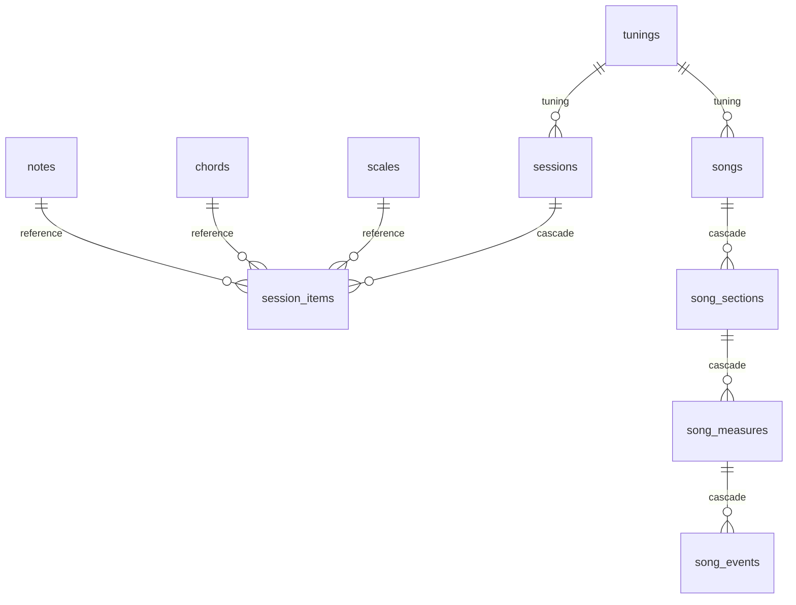

# 06 — Data Model

Base de datos MySQL `harmony`, migrada por `database/migrate.php` desde `001_initial.sql` (idempotente). **10 tablas** en 3 grupos.

## ER

## Catálogo (referencia)

| Tabla | Campos | Uso |
|---|---|---|
| `notes` | id, name, chromatic_position | 12 notas (0–11) |
| `chords` | id, name, formula | fórmula de intervalos (CSV) |
| `scales` | id, name, formula | fórmula de intervalos (CSV) |
| `tunings` | id, name, notes | posiciones cromáticas por cuerda (ej. `4,9,2,7,11,4`) |

## Sesiones (fretboard)

| Tabla | Campos | FKs |
|---|---|---|
| `sessions` | id, name, tuning_id, timestamps | `tuning_id → tunings(id)` |
| `session_items` | id, session_id, type ENUM(CHORD/SCALE), reference_id, root_note, position | `session_id → sessions(id) ON DELETE CASCADE` |

## Song Builder

| Tabla | Campos | FKs |
|---|---|---|
| `songs` | id, name, bpm, tuning_id, time_signature_num/den, timestamps | `tuning_id → tunings(id)` |
| `song_sections` | id, song_id, name, color, position | `song_id → songs(id) ON DELETE CASCADE` |
| `song_measures` | id, section_id, position | `section_id → song_sections(id) ON DELETE CASCADE` |
| `song_events` | id, measure_id, beat, element_type ENUM(CHORD/SCALE), element_id, root_note, notes | `measure_id → song_measures(id) ON DELETE CASCADE` |

> Los eventos se almacenan como **cambios** (no cada beat): un compás solo persiste los elementos que suenan.

## Índices

`idx_session_items_session`, `idx_sessions_tuning`, `idx_songs_tuning`, `idx_song_sections_song`, `idx_song_measures_section`, `idx_song_events_measure` (creados de forma idempotente).

> Lectura orientada a objetos en [[04-Domain-Layer]].
