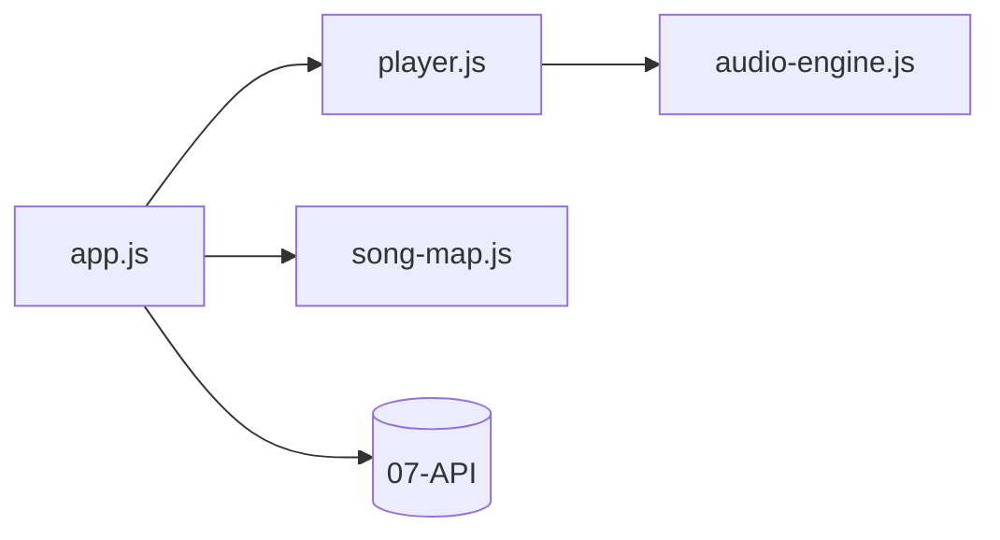

# 08 — Frontend

SPA vanilla JS servida en `/frontend/` (Apache). Sin build step. `API_BASE = '/api'` — llamadas REST limpias a [[07-API]].

## Módulos

| Módulo | Responsabilidad |
|---|---|
| `app.js` | estado global + orquestación: fretboard, sesiones, harmony, Song Builder, tabs |
| `player.js` | reproducción: scheduling de compases/beats sobre `player_data`, metrónomo, loop |
| `song-map.js` | mapa visual de compases (scroll, selección, loop range) |
| `audio-engine.js` | Web Audio API: síntesis de notas (osciladores), contexto único |

## Flujos principales

### Fretboard / Sesiones
- `loadChords/Scales/Notes/Tunings` → `GET /api/*` → puebla selects.
- `createSession` → `POST /api/sessions`. Los **items** viven en memoria (`items[]`); se envían a `POST /api/harmony`.
- `calculateHarmony` → `POST /api/harmony` → render SVG del heatmap + barras de influencia.

### Song Builder
- `createSong/loadSongs` → `POST/GET /api/songs`.
- `openSongEditor` → `GET /api/songs/{id}` (detalle con `sections→measures→events`).
- `addSection` → `POST /api/songs/{id}/sections`; `addMeasure` → `POST /api/sections/{id}/measures`; `applyToMeasure` → `POST /api/measures/{id}/events`.
- Tras cada edición refresca `GET /api/songs/{id}` y re-renderiza.

### Player
- `selectPlayerSong` / `playFromEditor` → `GET /api/songs/{id}?player=1` → `player_data` (bpm, métrica, `measures[]` con heatmaps y colores de sección).
- `player.js` reproduce los compases; `song-map.js` pinta y resalta el compás actual.

## Estado compartido (app.js)

`currentSong`, `playerSongData`, `items`, `lastHeatmap`, `lastInfluence`, `clipboard` — todas las vistas leen de estos singletons globales.
