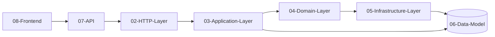

# Harmony — Mapa de Documentación

Sistema de armonía musical para guitarra: calculadora de **fretboard/heatmap**, **sesiones** y **Song Builder** con **player**. API en PHP (Slim 4 + PHP-DI) y frontend en JS vanilla.

> Vault de Obsidian: navega el graph view (`Ctrl+G`) para ver las relaciones entre capas.

## Índice

| Nota | Contenido |
|---|---|
| [[01-Arquitectura]] | Visión de capas, DI, flujo de una petición |
| [[02-HTTP-Layer]] | Rutas REST, Actions, Middleware |
| [[03-Application-Layer]] | Services (Song, Session, Heatmap) |
| [[04-Domain-Layer]] | Modelo musical, entidades, interfaces, excepciones |
| [[05-Infrastructure-Layer]] | PDO, repositorios MySql, bindings DI |
| [[06-Data-Model]] | Esquema de BD y relaciones (ER) |
| [[07-API]] | Endpoints REST completos |
| [[08-Frontend]] | Módulos JS y su relación con el API |
| [[09-Refactor]] | Migración legacy → Slim 4 (antes/después) |

## Mapa de relaciones (resumen)

**Stack:** PHP 8 + Slim 4 + PHP-DI/slim-bridge + MySQL + JS vanilla (Web Audio API).
